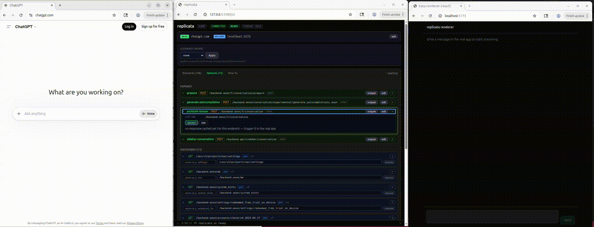

# replicata

Observe real streaming web apps and replay their bytes into your local renderer. Real chunk timing, real SSE framing, real edge cases — no mocks, no API keys, no cost.

Replicata is a passive tap on your own browser. You drive a real app (ChatGPT, Claude, any streaming web app), replicata observes the bytes via CDP, and replays them into your localhost code. Your renderer doesn't know the difference — it just calls `fetch()` and gets real production data back.



## How it works

```
You type in ChatGPT          →  ChatGPT streams a response
                                    ↓
                              replicata tees the stream (passive, invisible)
                                    ↓
Your renderer: fetch('/api/chat')  →  replicata serves the same bytes
                                      with original chunk timing
```

Three Chrome tabs: the real app, your renderer, and the replicata UI. Replicata connects via Chrome DevTools Protocol — it never automates the real app, never fires events into it, never makes requests on your behalf.

## Quickstart

```bash
# install
git clone https://github.com/codalife/replicata.git
cd replicata
npm install

# launch Chrome with remote debugging
npm run chrome

# in another terminal — start replicata
npm run dev

# in another terminal — start the example renderer
npm run example
```

1. In the Chrome window, navigate to a streaming app (e.g. chatgpt.com) and log in
2. Open the replicata UI tab → pick the real app tab and your renderer tab
3. Send a message in the real app → bytes flow to your renderer

## What it does

- **Stream tee** — taps `response.body` via `tee()`, zero disruption to the real app
- **Endpoint catalog** — auto-discovers API endpoints, normalizes URLs, lets you expose them for replay
- **Replay with timing** — serves captured streams with original chunk delays
- **Element tagging** — pick elements in the real app, pair them with your renderer via `data-replicata-tag`
- **Event forwarding** — click/type in the real app → synthetic events fire in your renderer
- **Scenario injection** — latency multiplier, mid-stream disconnect, dropped chunks, rate-limit responses, malformed data
- **Chunks export** — copy captured chunks with real timing for use in tests (MSW, Playwright, etc.)
- **Discovery** — surfaces interactive elements via React fiber walking + MutationObserver
- **State timeline** — content signature comparison between real app and your renderer

## Example renderer

The included React example parses ChatGPT's delta-encoding v1 format and renders markdown:

```bash
npm run example
# opens http://localhost:5173
```

See [`examples/react-renderer/src/App.tsx`](examples/react-renderer/src/App.tsx) for the implementation.

## Architecture

```
Real app (ChatGPT)                    Your renderer (localhost)
       │                                      │
       │  response.body.tee()                 │  fetch('/api/chat')
       │         │                            │         │
       │    leg A (app)                       │    redirected to
       │    leg B ──► replicata server ◄──────┘    /stream/ep_xxx
       │              (Node.js)                         │
       │              StreamBuffer ─────────────► replay with timing
```

- **Read end (real app):** passive `tee()` — ToS-clean, invisible to the app
- **Write end (renderer):** active URL redirect — your `fetch()` is rewritten to hit replicata's server
- **Events:** real app → replicata → renderer (never the other direction)

See [`docs/flow.mmd`](docs/flow.mmd) for the full sequence diagram.

## Project structure

```
core/
  bootstrap/       CDP connection with retry
  observe/         network tap, element picker, discovery, endpoint catalog
  bridge/          stream buffer, HTTP server, scenario injection
  injected/        browser-side scripts (fetch tap, event forwarding, etc.)
  tagging/         element tagging + persistence
  machine.ts       XState runtime state machine
  runtime.ts       main orchestrator
ui/                Svelte 5 UI (Elements, Network, How To tabs)
cli/               entry point + chrome subcommand
examples/          React renderer with ChatGPT delta parser + markdown
specs/             Quint formal specifications (found 2 real bugs)
tests/             vitest unit tests
```

## Formal verification

The runtime state machine has a [Quint](https://github.com/informalsystems/quint) specification that model-checks lifecycle invariants. It caught two real bugs during development:

- Stream stuck in `replaying` state after renderer disconnect
- Missing localhost guard on real-app assignment

```bash
npm i -g @informalsystems/quint
quint test specs/replicata-machine.qnt
quint run --invariant=allInvariants specs/replicata-lifecycle.qnt --max-steps=30 --max-samples=500
```

## Development

```bash
npm run dev           # build + run
npm run dev:watch     # rebuild on change (type-checked)
npm test              # run tests
```

## How is this different from...

- **Mocking APIs (MSW, Polly.js):** Mocks use data you write. Replicata uses data from the real app — timing, framing, edge cases you didn't think to mock.
- **Using the API directly (OpenAI, Anthropic):** Costs money per request. Replicata uses your existing browser session — zero cost, zero keys.
- **Recording with DevTools:** DevTools shows you the data but can't replay it into your app with original timing or inject failure scenarios.
- **Proxies (mitmproxy, Charles):** Proxies intercept at the network level. Replicata taps at the JavaScript level (`response.body.tee()`), which is invisible to TLS and bot detection.

## License

MIT
